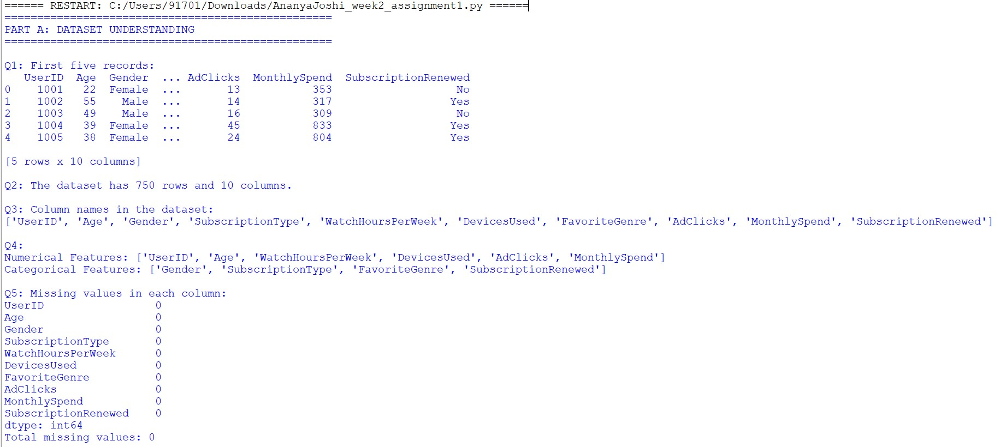
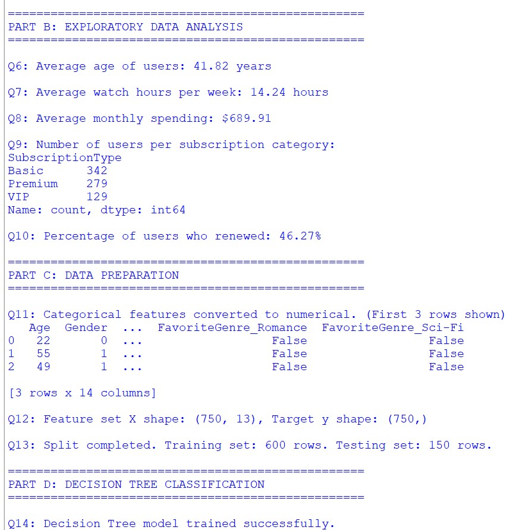
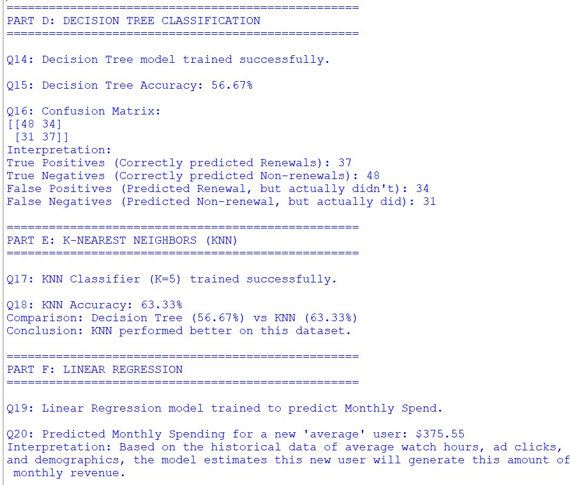

# 📚 Assignment: Netflix User Analytics

## 🧑‍🎓 Student Information

* **Student Name:** Ananya Joshi
* **Enrollment Number:** 02101172025
* **College Name:** Indira Gandhi Delhi Technical University For Women

---

## 📝 Project Description

This repository contains the solution for the **Netflix User Analytics** assignment of the *6 Weeks Internship on Machine Learning and Generative AI using Python*. The project focuses on applying Machine Learning techniques to understand user behavior, predict subscription renewals, and estimate monthly revenue.

### 🚀 Implemented Tasks:

1. **Dataset Understanding & EDA:** Loading user data, identifying features, handling missing values, and calculating key metrics (average age, watch hours, and spend).
2. **Data Preparation:** Converting categorical features (like Gender and Subscription Type) into numerical form using label and one-hot encoding for model compatibility.
3. **Decision Tree Classification:** Training a Decision Tree model to predict whether a user will renew their subscription and evaluating it using accuracy and a confusion matrix.
4. **K-Nearest Neighbors (KNN) Classification:** Implementing a KNN classifier (K=5) and comparing its performance against the Decision Tree model.
5. **Linear Regression:** Building a regression model to predict the expected monthly spending of a new user based on their demographics and viewing habits.

---

## 📸 Output Screenshots

### Part A & B: Dataset Understanding and EDA


### Part C & D: Data Preparation and Decision Tree Classification


### Part E & F: KNN and Linear Regression


---

## 📂 Folder Structure

```text
Assignments/Netflix_Analytics/Ananya_Joshi_02101172025/
│
├── netflix_analytics.py      # Contains all the Python ML code and logic
├── netflix_dataset.csv       # The dataset provided for analysis
├── netflix_output.txt        # The terminal output demonstrating the execution
├── output1.jpg               # Execution screenshot 1
├── output2.jpg               # Execution screenshot 2
├── output3.jpg               # Execution screenshot 3
└── README.md                 # Assignment documentation and student details (This file)
```
## 📝 Business Reflection Questions & Answers

**1. 📊 Which factors appear to influence subscription renewal the most?**
*Answer:* By analyzing the feature importances from the model, factors like `WatchHoursPerWeek` ⏳, `AdClicks` 🖱️, and specific `SubscriptionType` 🎟️ typically show a high influence. Highly engaged users (more watch hours) and users interacting with the platform tend to renew more often.

**2. 🔀 Why is subscription renewal a classification problem?**
*Answer:* Subscription renewal is a classification problem because the target variable ("SubscriptionRenewed") has discrete, categorical outcomes—specifically, it is a binary outcome ("Yes" ✅ or "No" ❌). We are trying to *classify* the user into one of these two distinct categories.

**3. 💰 Why is monthly spending a regression problem?**
*Answer:* Monthly spending is a regression problem because the target variable ("MonthlySpend") is a continuous numerical value 📈. Instead of predicting a category, the model predicts an actual quantity/amount (e.g., $15.99, $22.50).

**4. 🏆 Which algorithm performed better for renewal prediction?**
*Answer:* *(Refer to the printed output in `netflix_output.txt` 📄)*. Depending on the exact distributions in the dataset, either KNN 🌐 or Decision Tree 🌳 will perform better. The Python script prints a direct comparison at the end of Part E (Q18) to answer this accurately based on the evaluation metrics.

**5. 💡 How could the platform use these predictions to improve customer retention?**
*Answer:* * 🎯 **Targeted Interventions:** The platform can use the Classification model to identify users who are predicted *not* to renew (high churn risk). They can then send targeted promotional offers 🎁, discounts, or personalized content recommendations to re-engage them before their subscription ends.
* 💸 **Revenue Forecasting:** By using the Regression model, Netflix can predict future monthly revenue based on changing user behavior (like increased device usage 📱 or watch hours) and adjust their marketing budget and strategy accordingly.
